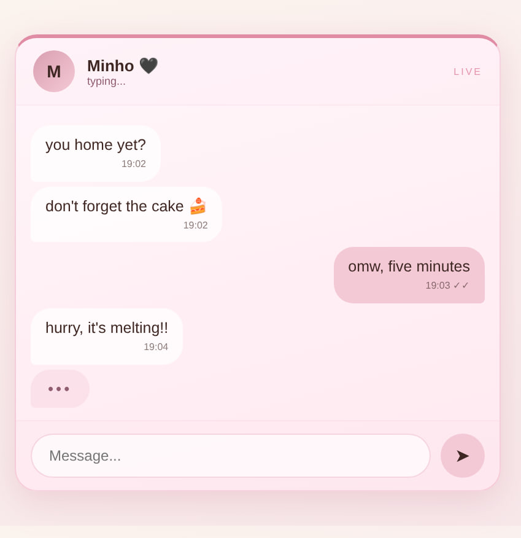
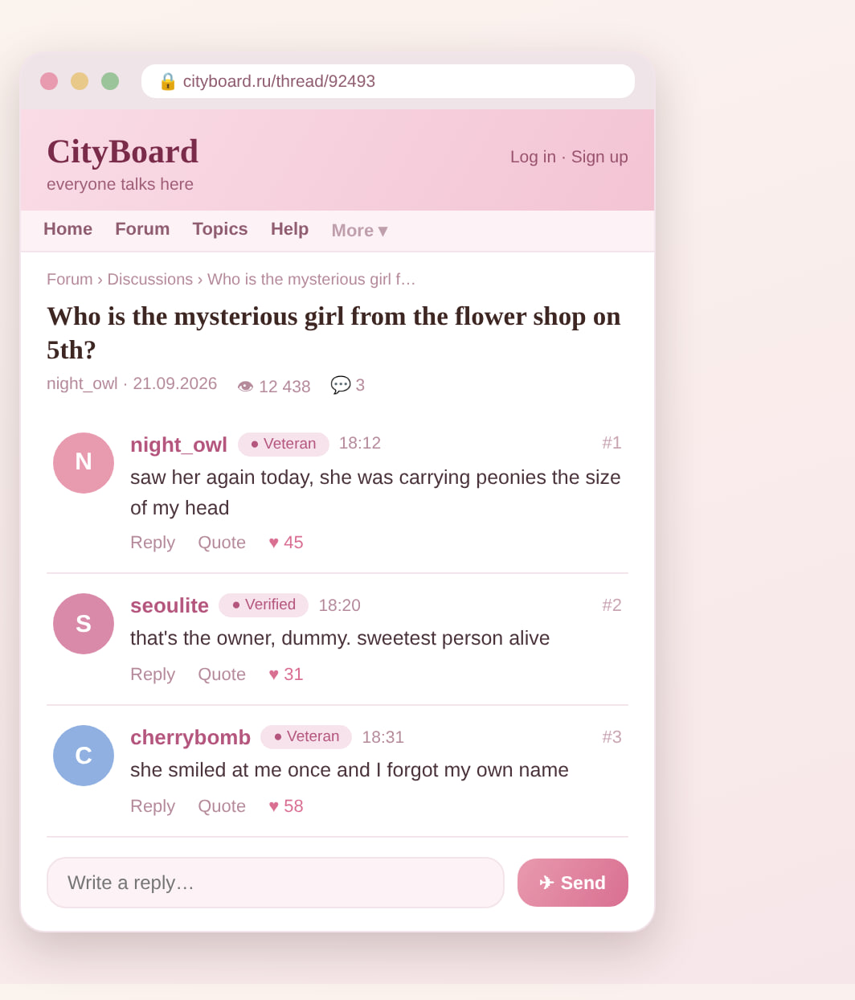
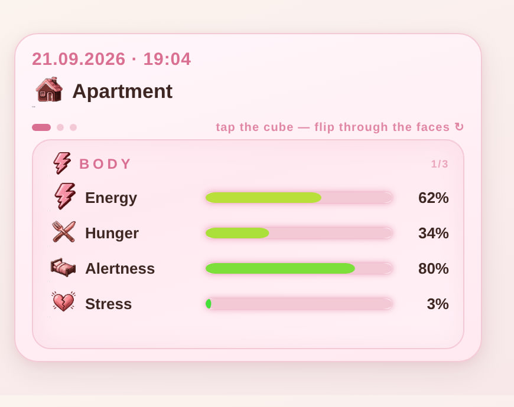
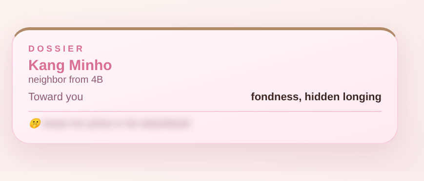
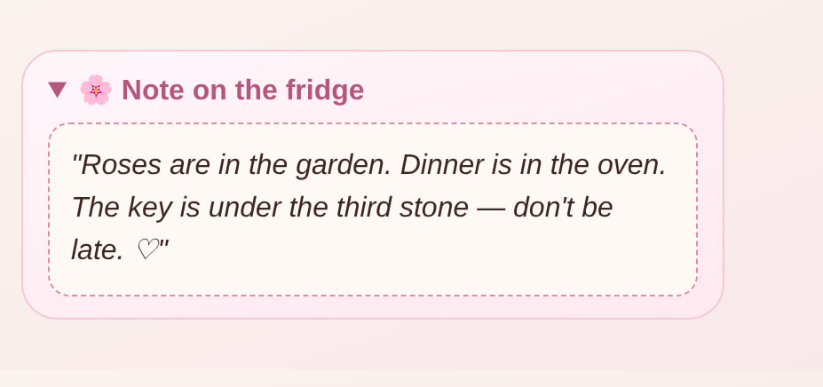
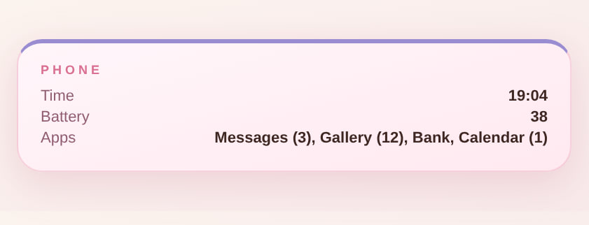
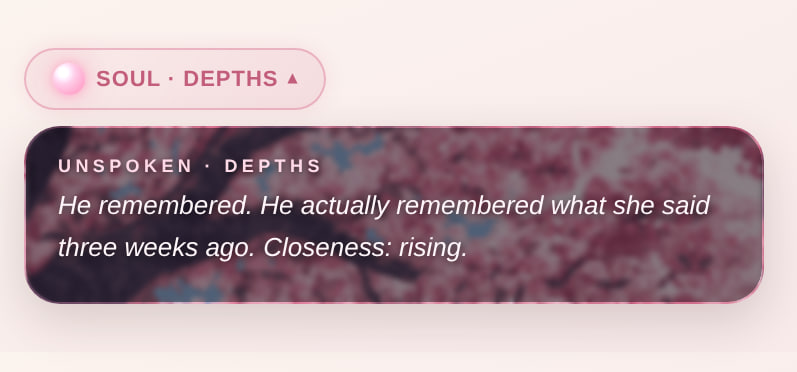
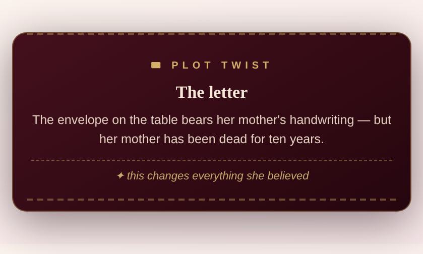

# 🌸 PeonySet 18+ v2 — English Edition

> A modular roleplay preset for **TavoAi**: realism, character autonomy, psychology, relationships and an immersive living world.

PeonySet is a roleplay preset created by **@floryhibi** for TavoAi.

It started as a personal preset for my own roleplays and gradually grew into a modular system with world rules, character psychology and interactive UI.

---

## ✨ Interactive UI

PeonySet renders living interfaces right inside the chat — dossiers, messengers, forums, status panels and more.

---

## 📦 What's inside

- 📄 **Preset** — `(eng_preset) 🌸 PeonySet 18+ v2 by @floryhibi.json`
- ⚙️ **Regex pack** — `(eng_regex) 🌸 PeonySet 18+ v2 by @floryhibi.zip` (interactive UI, status panels, media blocks)
- 📖 **Interactive guide** — `PeonySet18+_v2_InteractiveGuide.html` (open in any browser)

## ⬇️ Install

1. Download both files from the [**Releases**](https://github.com/floryhibi/Tavo_PeonySet_by-floryhibi/releases/tag/v2.0-en) page (Assets).
2. TavoAi → **Presets** → import the `.json` file.
3. TavoAi → **Regex** → import **every** regex file from the `.zip` — they work as a set, the UI will break if some are missing.
4. Open the interactive guide in your browser for setup tips and feature overview.

## 🔗 Links

- 💬 **TavoAi Discord** — find me in the presets channels: https://discord.com/channels/1356606095207960616/1551602612997070918
- 🏠 **Tavo Hub creator page** — https://hub.tavoai.dev/creators/HQ4G1
- 🤗 **Chub.ai** — https://chub.ai (search: floryhibi)

## ⚠️ Notes

- 18+ content preset. Use responsibly.
- Regexes are tuned for **On Display** timing and character messages — import with default settings.
- Tested on TavoAi v0.91+.

## 📜 License

[CC BY-NC 4.0](https://creativecommons.org/licenses/by-nc/4.0/) — share and adapt freely with credit, no commercial use.

---

made with 🌸 by <b>@floryhibi</b>

